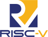

# Hi there 👋

My name is **Chang Min Bark** and I am currently a computer science and engineering/business management student at Bucknell University (class of 2026). I interned as a production engineer at Meta, which is a cross between SWE and SRE. I also interned as a Backend Engineer at Hangry, where I developed a notification microservice and wrote my own message queue using Redis. I also participated in the Google Summer of Code program: [project](https://summerofcode.withgoogle.com/archive/2024/projects/9916Xzin).

Below are my personal projects. If you have any questions regarding my work for open source projects and internships, please reach out to me (I will show it to you through a meeting).

### Note

I also have private repositories that I can show if you contact me! They include things like implementing a message queue using Redis in Go (notification microservice), networking in C, TypeScript (Next.JS) projects, etc.

### Portfolio Website

Check out my [portfolio website](https://changminbark.github.io/) (might not be up to date)!

### Project/Startup Websites

Checkout my agentic teaching assistant app with an RAG pipeline [Chiron](https://www.chiron-ta.com/)!

### Skills

 &nbsp;

 &nbsp;
 &nbsp;
 &nbsp;
 &nbsp;
 &nbsp;
 &nbsp;
 &nbsp;
 &nbsp;
 &nbsp;
 &nbsp;
 &nbsp;

### Socials

 
 
 &nbsp;

<!-- ### My GitHub Stats

 -->

### What I'm listening to at the moment

